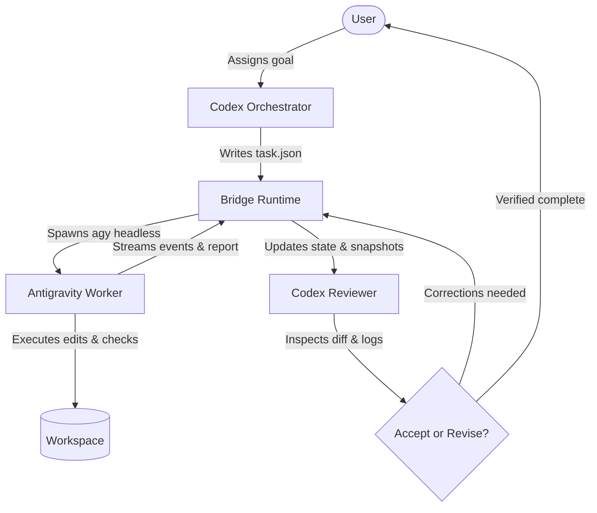

# codex-antigravity-skills

[](https://www.python.org/)
[](LICENSE)
[](pyproject.toml)


[Tiếng Việt](README.vi.md) | **English**

---

A dependency-free integration bridging **Codex** (for strategy, planning, and review) and **Antigravity CLI** (as the headless implementation worker) into an evidence-driven local development workflow.

---

## The Problem

In everyday development with AI assistants:
- **Codex** excels at planning, high-level architecture, user alignment, and thorough code review inside VS Code.
- **Antigravity** provides powerful autonomous editing, code search, and command execution via its headless CLI (`agy`).

Without an automated bridge, developers must repeatedly copy prompts, paste status updates, manually configure tools each session, and risk unverified claims of task completion. `codex-antigravity-skills` eliminates this friction: Codex plans and reviews, while Antigravity implements in the background and reports back with structured test evidence.

> [!IMPORTANT]
> **Environment & Windows Sandbox Caveat**: This bridge is designed for same-account user desktop environments (such as a standard VS Code session and interactive user terminal sharing credentials). On Windows, if Codex executes inside a sandboxed container with separate process identities, user authentication tokens (stored in `AppData\Local` or the Windows Credential Manager) may be inaccessible to sandbox worker subprocesses. Do not expect fully unattended headless operation in isolated sandboxes where credentials are not shared.

---

## Roles and Architecture



1. **Codex Orchestrator (`codex-orchestrator`)**:
   - Analyzes project context, dependencies, and Git state.
   - Formulates strict, bounded tasks (`objective`, `scope`, `acceptance_checks`, `commands`, `decisions`).
   - Dispatches Antigravity via the local bridge runtime and prevents race conditions with atomic workspace locks.
2. **Antigravity Worker (`antigravity-worker`)**:
   - Runs in headless mode (`agy --input-format stream-json --output-format stream-json`).
   - Edits code within assigned scope boundaries and runs permitted checks.
   - Submits structured JSON reports containing test outcomes, changed files, risks, and blockers.
3. **Codex Reviewer (`codex-reviewer`)**:
   - Collects durable run artifacts (`events.ndjson`, `stderr.log`, Git before/after snapshots).
   - Verifies claimed test outcomes against actual logs and working tree diffs.
   - Either resumes the exact conversation with actionable feedback (`revise`) or records evidence-backed approval (`accept`).

---

## Quick Start

### Prerequisites

- **Python**: Version 3.10 or later (standard library only; no external package dependencies).
- **Antigravity CLI (`agy`)**: Installed and authenticated in your user account.
- **Codex**: Installed in VS Code or CLI with skill discovery enabled.

### Installation Steps

1. **Authenticate Antigravity**: Run `agy` interactively in your terminal to ensure you are logged in:
   ```bash
   agy
   ```
2. **Preview Changes (Dry Run)**:
   ```bash
   python scripts/install.py --dry-run
   ```
3. **Install Runtime and Skills**:
   ```bash
   python scripts/install.py
   ```
   On Windows PowerShell:
   ```powershell
   python scripts\install.py
   ```
4. **Restart Codex**: Start a new Codex session in VS Code to discover the installed skills.

For advanced installation options (custom directories, backups, conflict handling, and permission allowlists), see [Installation Documentation](docs/installation.md).

---

## Daily VS Code Workflow

Once installed, simply interact with Codex in VS Code:

1. **Instruct Codex**: Ask Codex to implement a feature or bug fix. Codex automatically activates `codex-orchestrator`.
2. **Dispatch**: Codex creates an external `task.json` and invokes:
   ```bash
   python -X utf8 ~/.gemini/antigravity-cli/codex-bridge/bridge.py dispatch --workspace "/path/to/project" --task-file "/path/to/task.json"
   ```
3. **Check Status**: Monitor progress or inspect run artifacts:
   ```bash
   python -X utf8 ~/.gemini/antigravity-cli/codex-bridge/bridge.py status --workspace "/path/to/project"
   ```
4. **Review & Revise**: Codex switches to `codex-reviewer` to inspect the diff and test logs. If corrections are needed:
   ```bash
   python -X utf8 ~/.gemini/antigravity-cli/codex-bridge/bridge.py revise --workspace "/path/to/project" --feedback-file "/path/to/feedback.md"
   ```
5. **Accept**: Once all acceptance criteria are proven with evidence:
   ```bash
   python -X utf8 ~/.gemini/antigravity-cli/codex-bridge/bridge.py accept --workspace "/path/to/project" --review-file "/path/to/review.md"
   ```

For comprehensive workflow details, see [Workflow Guide](docs/workflow.md).

---

## Command Reference

| Command | Purpose | Required Arguments |
|---|---|---|
| `dispatch` | Start a new task on an idle workspace | `--workspace`, `--task-file` |
| `status` | Display current workspace status and state directory | `--workspace` |
| `collect` | Return state JSON with artifact and log locations | `--workspace` |
| `revise` | Resume existing conversation with correction feedback | `--workspace`, `--feedback-file` |
| `retry` | Retry failed startup (only if no conversation ID was created) | `--workspace`, `--feedback-file` |
| `accept` | Record evidence-backed acceptance and complete task | `--workspace`, `--review-file` |

Additional options:
- `--timeout <seconds>`: Execution timeout in seconds (default: 900).
- `--agy-executable <path>`: Override the `agy` binary location (or use `CODEX_AGY_EXECUTABLE`).
- `--state-dir <path>`: Override persistent workspace state directory (or use `CODEX_AGY_STATE_DIR`).

For troubleshooting and common edge cases, see [Troubleshooting Guide](docs/troubleshooting.md).

---

## Limitations & Security Boundary

- **Guidance vs Enforcement**: Skill markdown files provide behavioral guidance to the LLM; they are not cryptographic or security boundaries. True command and file system boundaries are enforced by your Antigravity CLI permissions and OS environment.
- **No Automatic Skip-Permissions**: The bridge does not pass flags to disable permission checks. If a command requires user approval and runs headless, Antigravity records a soft denial (`denied_actions`) and the bridge marks the state as `blocked`.
- **Never Blindly Retry**: The `retry` command is reserved strictly for immediate process start failures before a session ID is established. Once a conversation exists, always use `revise` with actionable diagnosis.

---

## Official Documentation Links

- [Antigravity CLI Headless Mode](https://www.antigravity.google/docs/cli/headless/)
- [Antigravity Permissions Reference](https://www.antigravity.google/docs/permissions/)
- [Antigravity Skills Reference](https://www.antigravity.google/docs/skills/)
- [OpenAI Codex Skills Guide](https://learn.chatgpt.com/docs/build-skills)
- [Codex AGENTS.md Configuration](https://learn.chatgpt.com/docs/agent-configuration/agents-md)

---

## License

This project is licensed under the MIT License - see the [LICENSE](LICENSE) file for details.

**Author**: elysszxje