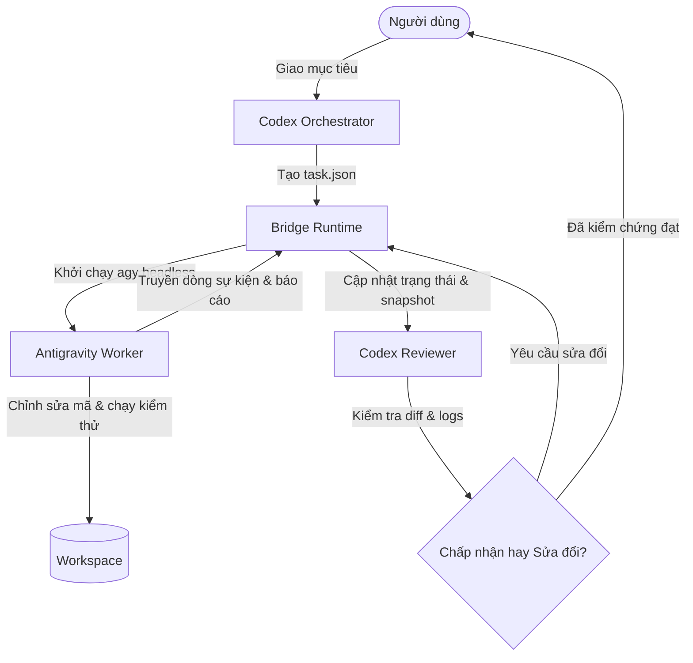

# codex-antigravity-skills (Tiếng Việt)

[](https://www.python.org/)
[](LICENSE)
[](pyproject.toml)


**Tiếng Việt** | [English](README.md)

---

Giải pháp cầu nối không phụ thuộc thư viện ngoài (dependency-free) kết hợp giữa **Codex** (định hướng chiến lược, lập kế hoạch và nghiệm thu mã nguồn) và **Antigravity CLI** (công nhân thực thi chạy ở chế độ headless) thành một quy trình phát triển cục bộ dựa trên bằng chứng kiểm thử rõ ràng.

---

## Vấn Đề Thực Tế

Trong quy trình phát triển phần mềm hàng ngày cùng các trợ lý AI:
- **Codex** phát huy thế mạnh lớn nhất ở vai trò lập kế hoạch, thiết kế kiến trúc, tương tác người dùng và đánh giá mã nguồn (code review) trực tiếp trong VS Code.
- **Antigravity** sở hữu khả năng tự chủ cao trong việc chỉnh sửa mã, tìm kiếm ngữ cảnh và thực thi lệnh thông qua giao diện dòng lệnh headless (`agy`).

Nếu thiếu một cầu nối tự động, lập trình viên thường phải sao chép prompt qua lại thủ công, dán kết quả cập nhật, cấu hình lại công cụ ở mỗi phiên làm việc và đối mặt với nguy cơ AI báo hoàn thành ảo khi chưa có bằng chứng thực tế. `codex-antigravity-skills` giải quyết triệt để vấn đề này: Codex định hướng và nghiệm thu, trong khi Antigravity âm thầm hiện thực hóa mã nguồn trong nền và báo cáo kèm bằng chứng kiểm thử cấu trúc.

> [!IMPORTANT]
> **Môi Trường Hoạt Động & Lưu Ý Về Windows Sandbox**: Cầu nối này được thiết kế tối ưu cho môi trường người dùng cùng một tài khoản hệ điều hành (phiên VS Code và cửa sổ dòng lệnh của cùng người dùng chia sẻ chứng chỉ xác thực). Trên Windows, nếu Codex chạy trong môi trường sandbox/container biệt lập với danh tính tiến trình riêng, các token xác thực (lưu trong `AppData\Local` hoặc Windows Credential Manager) có thể không truy cập được bởi tiến trình con trong sandbox. Không kỳ vọng hệ thống tự vận hành 100% trong môi trường sandbox nếu token xác thực không được chia sẻ.

---

## Phân Vai và Kiến Trúc



1. **Codex Orchestrator (`codex-orchestrator`)**:
   - Phân tích ngữ cảnh dự án, các phụ thuộc và trạng thái Git hiện tại.
   - Thiết lập nhiệm vụ có ranh giới rõ ràng (`objective`, `scope`, `acceptance_checks`, `commands`, `decisions`).
   - Điều phối Antigravity thông qua runtime cầu nối cục bộ và ngăn ngừa xung đột bằng khóa workspace nguyên tử (`active.lock`).
2. **Antigravity Worker (`antigravity-worker`)**:
   - Chạy ở chế độ dòng lệnh headless (`agy --input-format stream-json --output-format stream-json`).
   - Thực hiện thay đổi mã trong phạm vi cho phép và chạy các lệnh kiểm thử được ủy quyền.
   - Gửi báo cáo JSON có cấu trúc gồm kết quả kiểm thử, danh sách file thay đổi, rủi ro và các vướng mắc (blockers).
3. **Codex Reviewer (`codex-reviewer`)**:
   - Thu thập artifact bền vững (`events.ndjson`, `stderr.log`, ảnh chụp Git trước/sau khi chạy).
   - Xác minh các kiểm thử được tuyên bố có thực sự vượt qua hay không dựa trên nhật ký và diff mã nguồn.
   - Hoặc tiếp tục đúng phiên hội thoại với phản hồi hiệu chỉnh (`revise`), hoặc ghi nhận phê duyệt có bằng chứng (`accept`).

---

## Hướng Dẫn Nhanh (Quick Start)

### Điều Kiện Cần

- **Python**: Phiên bản 3.10 trở lên (chỉ dùng thư viện chuẩn, không cài thêm thư viện ngoài).
- **Antigravity CLI (`agy`)**: Đã được cài đặt và xác thực đăng nhập trong tài khoản của bạn.
- **Codex**: Đã được cấu hình trong VS Code hoặc CLI và hỗ trợ khám phá kỹ năng (skills).

### Các Bước Cài Đặt

1. **Xác thực Antigravity**: Chạy `agy` tương tác trong terminal của bạn để kiểm tra trạng thái đăng nhập:
   ```bash
   agy
   ```
2. **Chạy Thử Nghiệm (Dry Run)**:
   ```bash
   python scripts/install.py --dry-run
   ```
3. **Tiến Hành Cài Đặt**:
   ```bash
   python scripts/install.py
   ```
   Trên Windows PowerShell:
   ```powershell
   python scripts\install.py
   ```
4. **Khởi Động Lại Codex**: Bắt đầu một phiên trò chuyện mới với Codex trong VS Code để hệ thống nhận diện các kỹ năng mới.

Chi tiết về các tùy chọn nâng cao, xử lý xung đột và cấu hình danh sách cấp quyền lệnh có trong [Tài liệu cài đặt](docs/installation.md).

---

## Quy Trình Hàng Ngày Trong VS Code

Sau khi cài đặt, bạn chỉ cần làm việc trực tiếp với Codex trong VS Code:

1. **Giao việc cho Codex**: Yêu cầu tính năng hoặc sửa lỗi. Codex sẽ kích hoạt kỹ năng `codex-orchestrator`.
2. **Điều phối (Dispatch)**: Codex tạo file `task.json` bên ngoài repo và chạy lệnh:
   ```bash
   python -X utf8 ~/.gemini/antigravity-cli/codex-bridge/bridge.py dispatch --workspace "/path/to/project" --task-file "/path/to/task.json"
   ```
3. **Xem tiến độ (Status)**: Kiểm tra trạng thái hoặc nhật ký bất cứ lúc nào:
   ```bash
   python -X utf8 ~/.gemini/antigravity-cli/codex-bridge/bridge.py status --workspace "/path/to/project"
   ```
4. **Đánh giá & Hiệu chỉnh (Review & Revise)**: Codex chuyển sang kỹ năng `codex-reviewer` để kiểm tra diff và log kiểm thử. Nếu cần sửa chữa:
   ```bash
   python -X utf8 ~/.gemini/antigravity-cli/codex-bridge/bridge.py revise --workspace "/path/to/project" --feedback-file "/path/to/feedback.md"
   ```
5. **Nghiệm thu (Accept)**: Khi toàn bộ tiêu chí nghiệm thu đã được chứng minh qua kết quả kiểm thử thực tế:
   ```bash
   python -X utf8 ~/.gemini/antigravity-cli/codex-bridge/bridge.py accept --workspace "/path/to/project" --review-file "/path/to/review.md"
   ```

Xem hướng dẫn toàn diện tại [Tài liệu quy trình](docs/workflow.md).

---

## Bảng Tra Cứu Lệnh

| Lệnh | Mục đích | Tham số bắt buộc |
|---|---|---|
| `dispatch` | Bắt đầu nhiệm vụ mới trên workspace đang rảnh (idle) | `--workspace`, `--task-file` |
| `status` | Xem trạng thái hiện tại và thư mục lưu trữ | `--workspace` |
| `collect` | Xuất toàn bộ JSON trạng thái và đường dẫn artifact | `--workspace` |
| `revise` | Tiếp tục đúng phiên hội thoại kèm phản hồi sửa đổi | `--workspace`, `--feedback-file` |
| `retry` | Thử lại phiên khởi động bị lỗi (chỉ khi chưa tạo conversation ID) | `--workspace`, `--feedback-file` |
| `accept` | Ghi nhận nghiệm thu dựa trên bằng chứng và hoàn tất task | `--workspace`, `--review-file` |

Các tùy chọn phụ trợ:
- `--timeout <giây>`: Thời gian chờ tối đa (mặc định: 900 giây).
- `--agy-executable <đường_dẫn>`: Chỉ định đường dẫn tới file thực thi `agy` (hoặc dùng `CODEX_AGY_EXECUTABLE`).
- `--state-dir <đường_dẫn>`: Đổi vị trí thư mục lưu trữ trạng thái ngoài repo (hoặc dùng `CODEX_AGY_STATE_DIR`).

Xem cách khắc phục sự cố tại [Tài liệu gỡ lỗi](docs/troubleshooting.md).

---

## Ranh Giới Bảo Mật & Giới Hạn

- **Chỉ dẫn hướng dẫn vs Thực thi quyền**: File markdown định nghĩa kỹ năng chỉ có tính chất định hướng hành vi cho mô hình AI; đây không phải là ranh giới bảo mật cấp hệ điều hành. Toàn bộ quyền truy cập file và thực thi lệnh đều do Antigravity CLI và sandbox hệ thống quản lý.
- **Không tự ý bỏ qua phân quyền**: Cầu nối không bao giờ tự động thêm cờ bỏ qua xác thực quyền (`--skip-permissions`). Khi một lệnh đòi hỏi phê duyệt nhưng chạy ở chế độ headless, Antigravity sẽ ghi nhận từ chối mềm (`denied_actions`) và cầu nối chuyển trạng thái về `blocked`.
- **Không thử lại mù quáng (Never Blindly Retry)**: Lệnh `retry` chỉ dành riêng cho các lỗi sập tiến trình ngay khi khởi động trước khi có session ID. Khi phiên hội thoại đã bắt đầu, luôn sử dụng `revise` kèm tài liệu chẩn đoán nguyên nhân.

---

## Tài Liệu Tham Khảo Chính Thức

- [Antigravity CLI Headless Mode](https://www.antigravity.google/docs/cli/headless/)
- [Antigravity Permissions Reference](https://www.antigravity.google/docs/permissions/)
- [Tài liệu Antigravity Skills](https://www.antigravity.google/docs/skills/)
- [Hướng dẫn xây dựng kỹ năng OpenAI Codex](https://learn.chatgpt.com/docs/build-skills)
- [Cấu hình AGENTS.md cho Codex](https://learn.chatgpt.com/docs/agent-configuration/agents-md)

---

## Giấy Phép

Dự án phát hành dưới giấy phép MIT License - xem file [LICENSE](LICENSE) để biết thêm chi tiết.

**Author**: elysszxje