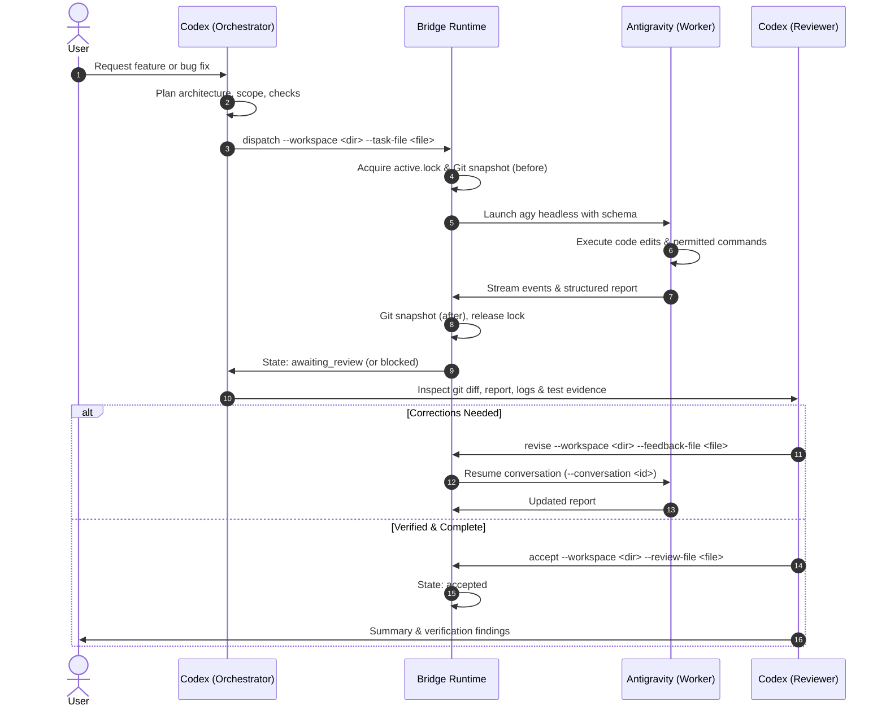

# Workflow Guide

This document describes the end-to-end task lifecycle between Codex and Antigravity.



## Lifecycle States

The workspace state transition machine operates through the following states:

- **`idle`**: No active task assigned to the workspace. Ready for `dispatch`.
- **`running`**: Worker is executing task instructions. Protected by an atomic `active.lock`.
- **`awaiting_review`**: Worker successfully finished execution and submitted valid structured output. Ready for Codex review.
- **`blocked`**: Worker encountered a permission denial, soft-denial, failed test check, or unhandled blocker. Requires inspection and correction via `revise`.
- **`failed`**: Process exited non-zero or crashed before completing valid output.
- **`interrupted`**: Execution was interrupted by user termination or timeout.
- **`accepted`**: Codex reviewed and recorded evidence-backed acceptance. Task complete.

## Daily VS Code Workflow

### 1. Codex Orchestration
When a task is presented in VS Code, Codex acts as the lead orchestrator:
- Checks the workspace Git status and existing instructions.
- Writes an external JSON task file (e.g. `C:/temp/task-001.json` or `/tmp/task-001.json`).

Example task format:
```json
{
  "objective": "Add retry backoff logic to HTTP client",
  "scope": [
    "src/client.py",
    "tests/test_client.py"
  ],
  "acceptance_checks": [
    "Unit tests pass with python -m unittest tests/test_client.py",
    "Backoff exponent scales up to maximum delay"
  ],
  "commands": [
    "python -m unittest discover -s tests -v"
  ],
  "decisions": [
    "Use exponential backoff with jitter",
    "Standard library urllib only"
  ]
}
```

### 2. Bridge Dispatch
Codex dispatches the task via the integrated terminal:
```bash
python -X utf8 ~/.gemini/antigravity-cli/codex-bridge/bridge.py dispatch --workspace "/path/to/project" --task-file "/path/to/task-001.json"
```

### 3. Monitoring & Status
You or Codex can query task progress at any time:
```bash
python -X utf8 ~/.gemini/antigravity-cli/codex-bridge/bridge.py status --workspace "/path/to/project"
```
Or collect full state and artifact locations:
```bash
python -X utf8 ~/.gemini/antigravity-cli/codex-bridge/bridge.py collect --workspace "/path/to/project"
```

### 4. Review & Evidence Collection
Once the worker returns `awaiting_review`:
- Codex switches to the `codex-reviewer` skill.
- Reviews `before.json` vs `after.json` Git snapshots, actual diffs, `events.ndjson`, and `stderr.log`.
- Verifies that all acceptance checks passed with concrete execution evidence.

### 5. Revisions
If changes are incomplete, tests failed, or permissions blocked an action:
- Codex writes concrete correction instructions to an external feedback file (e.g. `/tmp/feedback.txt`).
- Codex issues a revision:
```bash
python -X utf8 ~/.gemini/antigravity-cli/codex-bridge/bridge.py revise --workspace "/path/to/project" --feedback-file "/path/to/feedback.txt"
```
This resumes the exact conversation ID in Antigravity, retaining worker context.

### 6. Acceptance
When all requirements and verification checks pass:
- Codex writes review evidence to an external review file (e.g. `/tmp/review.txt`).
- Codex accepts the task:
```bash
python -X utf8 ~/.gemini/antigravity-cli/codex-bridge/bridge.py accept --workspace "/path/to/project" --review-file "/path/to/review.txt"
```
The workspace transitions to `accepted`.
